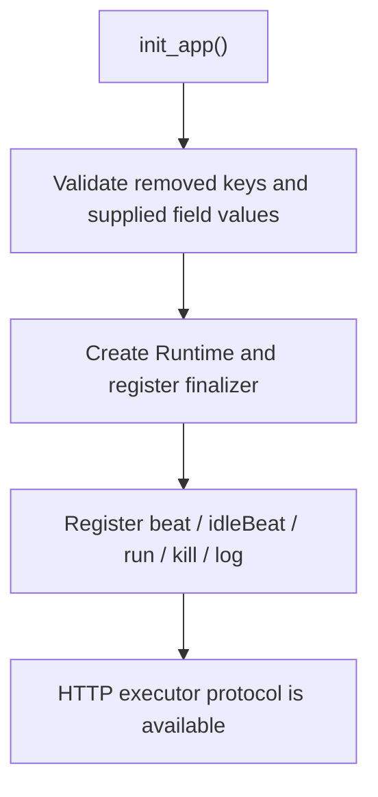
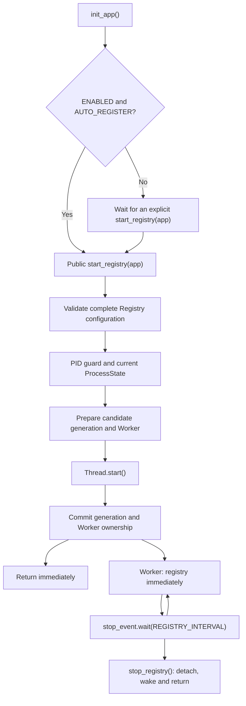

[English](deployment.md) | [简体中文](deployment.zh-CN.md)

# Deployment

## Two independent paths

Initializing the HTTP executor protocol does not require a running Registry
lifecycle.



Registry is a separate, process-local path:



The five executor endpoints, Handler dispatch, task execution and Callback API
are unchanged. Registry still registers immediately and then renews every
`REGISTRY_INTERVAL`.

## Lifecycle shutdown

`stop_registry()` is a local, non-blocking stop. It does not join, contact
Admin, or change the latest `registered` snapshot. A later
`stop_registry(remove=True)` may still consume the same lifecycle generation's
single automatic Remove eligibility, even after its Worker has exited.

`stop_registry(remove=True)` schedules the removal in the background. A Pending
Remove can be cancelled by a newer successful start; an Active Remove completes
first while the new Worker waits in the background. All Registry RPCs in one
process—renewal, background removal, `register_executor()` and
`remove_executor()`—share one network lock and never overlap.

For deterministic removal and its `CallResult`, use:

```python
xxl_job.stop_registry(app)
result = xxl_job.remove_executor(app)
```

Do not combine this with `stop_registry(remove=True)` for the same intended
removal.

## Executor address

Set `XXL_JOB_EXECUTOR_ADDRESS` to a URL the Admin can reach. In containers or
multi-host deployments this is normally a service address, not `127.0.0.1`.
Set only the base URL; `XXL_JOB_ROUTE_PREFIX` is appended automatically.

## Gunicorn preload and fork safety

Use explicit Registry startup when the application can be imported before
forking:

```python
app.config["XXL_JOB_AUTO_REGISTER"] = False
xxl_job.init_app(app)

# Run only in a worker/process that should own Registry renewal.
xxl_job.start_registry(app)
```

Every local state access performs a PID guard first. A child replaces the
entire Registry ProcessState without acquiring a parent Lock, inspecting a
parent Worker, joining a parent Thread, or setting a parent Event. The Runtime,
handlers, callbacks, routes, pure configuration and resource-free AdminClient
remain attached to the application.

This is process safety, not leader election. Every Gunicorn worker that calls
`start_registry()` owns its own process-level Registry Worker. Flask-XXLJob does
not add a cross-process lock or automatically choose one worker.

## Flask and Celery sharing a factory

Initialize the protocol in both process types, but start Registry only in the
process that should renew the executor:

```python
def create_app(start_executor_registry=False):
    app = Flask(__name__)
    app.config["XXL_JOB_AUTO_REGISTER"] = False
    xxl_job.init_app(app)
    if start_executor_registry:
        xxl_job.start_registry(app)
    return app
```

Flask-XXLJob neither detects Celery nor creates Celery tasks.

## Exit removal and shared addresses

`XXL_JOB_DEREGISTER_ON_EXIT=False` is the default. Each process stops local
renewal during finalization but does not remove a shared Admin identity. Enable
it only when one Python process owns one exclusive executor address. Exit
removal is best-effort and the finalizer never waits for a Worker, Event,
cleanup actor, or Admin RPC; immediate interpreter exit, `SIGKILL`, and forced
container shutdown can prevent completion.

The exit path obeys the same lifecycle eligibility as explicit automatic
Remove: generation zero is not removed and one generation is attempted at most
once. A one-shot `register_executor()` does not create a lifecycle and therefore
is not automatically paired at exit; call `remove_executor()` explicitly.

## Job timeout and logging

Task timeout remains an XXL-JOB Admin job setting, not a Registry setting. For
Celery or other async work, configure the Admin timeout and call
`callback_success()` or `callback_failure()` when work finishes.

For containers, prefer console-only managed logging. Managed Handler shutdown
is coordinated with outstanding Registry cleanup and closes at most once. A
standard rotating file handler is process-local and does not make one shared
file safe for multiple workers.
