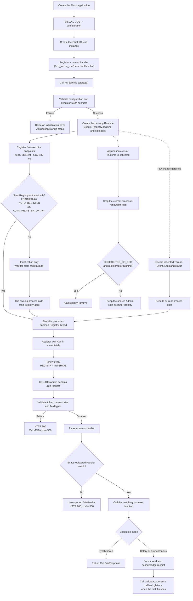

[English](deployment.md) | [简体中文](deployment.zh-CN.md)

# Deployment

## End-to-end lifecycle



## Executor address

Set `XXL_JOB_EXECUTOR_ADDRESS` to a URL the XXL-JOB admin can reach. In
containerized or multi-host deployments this is usually the service address,
not `127.0.0.1`. Set only the service base URL; `XXL_JOB_ROUTE_PREFIX` is
appended automatically when the configuration is loaded.

## Job timeout for long-running work

Task timeout is configured in XXL-JOB Admin (per job, in seconds), not in
Flask-XXLJob. For Celery or other async workers, raise that timeout above the
longest expected runtime, and have the worker call `callback_success` /
`callback_failure` when finished. See [Task-Result Callback](callback.md).

## Automatic registry lifecycle

When `XXL_JOB_ENABLED`, `XXL_JOB_AUTO_REGISTER`, and
`XXL_JOB_AUTO_REGISTER_ON_INIT` are all `True`, `init_app()` starts a daemon
registry thread. Registration happens immediately in that background thread,
then renews on the configured interval. Failures are logged and never crash the
application. `start_registry(app)` is non-blocking and idempotent.

Set `XXL_JOB_AUTO_REGISTER_ON_INIT=False` when application construction and the
registry lifecycle belong to different process phases:

```python
app.config.update(
    XXL_JOB_AUTO_REGISTER=True,
    XXL_JOB_AUTO_REGISTER_ON_INIT=False,
)
xxl_job.init_app(app)

# Call only after this process should own a renewal thread.
xxl_job.start_registry(app)
```

The extension does not inspect `app.debug`, `WERKZEUG_RUN_MAIN`, Gunicorn, or
Celery. The host decides which process calls `start_registry()`.

## Gunicorn preload and fork safety

With Gunicorn `--preload`, use delayed startup and call `start_registry(app)`
from worker-side initialization after fork; do not start it in the preload
master. If a Flask application object is inherited across a fork, the extension
detects the PID change before touching inherited locks and rebuilds its local
thread, event, locks, shutdown flags and registry status. It never joins a
parent-process thread.

This guarantees correct state inside each worker; it does not elect a single
registry leader. Every worker that calls `start_registry()` owns one renewal
thread.

## Shared address and multiple workers

Workers using different executor addresses represent separate executor
instances and can keep `XXL_JOB_DEREGISTER_ON_EXIT=True`. Workers using the same
app name and address share one Admin-side identity. In that case use:

```python
app.config.update(
    XXL_JOB_DEREGISTER_ON_EXIT=False,
)
```

Each worker still stops its local thread during Runtime cleanup, but one worker
exiting will not remove the shared identity. The setting affects automatic
cleanup only: explicit `stop_registry()` still deregisters, while
`stop_registry(remove=False)` stops renewal without deregistration.

## Flask and Celery sharing an Application Factory

Initialize the extension for both process types, but start Registry only in the
web process that exposes the executor endpoints:

```python
def create_app(start_executor_registry=False):
    app = Flask(__name__)
    app.config["XXL_JOB_AUTO_REGISTER_ON_INIT"] = False
    xxl_job.init_app(app)
    if start_executor_registry:
        xxl_job.start_registry(app)
    return app


web_app = create_app(start_executor_registry=True)
# Celery, CLI and tests call create_app() without starting Registry.
```

Flask-XXLJob does not detect Celery or create Celery tasks; lifecycle ownership
stays explicit in the host application.

For plugin diagnostics in containers, prefer console-only output and let the
platform collect, retain and rotate logs:

```python
app.config.update(
    XXL_JOB_LOG_ENABLED=True,
    XXL_JOB_LOG_FILE_ENABLED=False,
    XXL_JOB_LOG_CONSOLE_ENABLED=True,
)
```

The standard `RotatingFileHandler` is process-local and does not make a shared
file safe for multiple Gunicorn or other worker processes. Use separate files,
host-managed Logging, or console aggregation instead. See [Logging](logging.md).

## One-shot registration

You can disable automatic renewal and register once from the CLI instead:

```bash
flask --app "project:create_app" xxljob register
```
