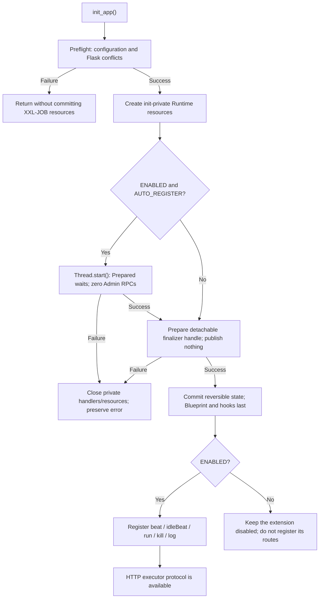
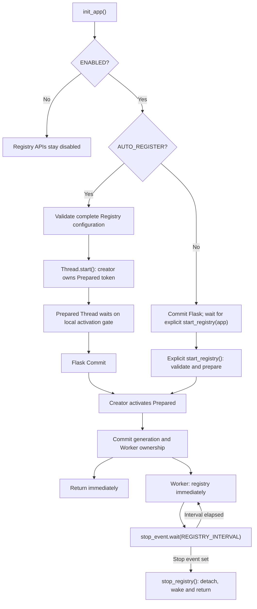
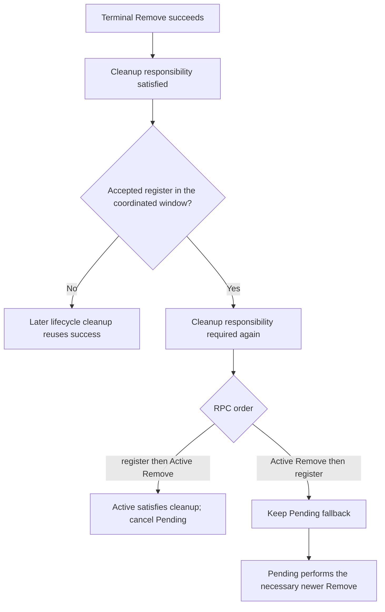

[English](deployment.md) | [简体中文](deployment.zh-CN.md)

# Deployment

## Two independent paths

When the extension is enabled, initializing the HTTP executor protocol does not
require a running Registry lifecycle. Disabling the extension is a total feature
switch: it disables the five routes and all Registry, Remove and Callback Admin
traffic. A Callback-only process uses `ENABLED=True`, `AUTO_REGISTER=False`.



Registry is a separate, process-local path:



The five executor endpoints, Handler dispatch, task execution and Callback API
are unchanged. Registry still registers immediately and then renews every
`REGISTRY_INTERVAL`.

Prepared ownership is a local initialization gate, not a public lifecycle
state: `is_running` and `registry_thread_running` remain false, and no Admin RPC
is possible before activation. Only the caller that created and successfully
started that Prepared Thread may activate it; a concurrent start cannot take
over the token. Registry `stop()`/shutdown may cancel it without blocking. If
activation committed first and stop then wins before the first RPC, the Thread
still enters the formal Worker `try/finally`, sends zero Registry calls, and
finishes its stopping/Pending/Scheduler ownership normally.

Prepared creation and `Thread.start()` share one short state-lock interval. A
start failure therefore remains before Flask commit and closes the
initialization's private managed handlers without joining an unstarted Thread.
The finalizer created next is only a detachable callback handle: it does not
publish Flask or application-registry state, and detaching it never calls
Runtime shutdown or Admin. An unknown commit failure gets bounded cancellation
of an owned Prepared Thread plus identity-safe cleanup of the finalizer, CLI,
extension and application record. Blueprint routes and hooks are not removed
through Flask private structures, so this is not a general Flask rollback.

## Lifecycle shutdown

`stop_registry()` is a local, non-blocking stop. It does not join, contact
Admin, or change the latest `registered` snapshot. A later
`stop_registry(remove=True)` may still request that generation's outstanding
cleanup responsibility, even after its Worker has exited.

`stop_registry(remove=True)` schedules the removal in the background. A Pending
Remove can be cancelled by a newer successful start; an Active Remove completes
first while the new Worker waits in the background. All Registry RPCs in one
process—renewal, background removal, `register_executor()` and
`remove_executor()`—share one network lock and never overlap.

Terminal cleanup is generation-aware but responsibility-based. One successful
terminal Active Remove is cached and reused by later shutdown or synchronous
terminal removal. If a register completion is accepted afterward in the same
generation, the remote identity exists again and a new cleanup responsibility
is opened. Registers that joined the coordination window before lifecycle
cleanup linearized are reconciled with the current Active and at most one
Pending fallback:



An explicit one-shot Register enters the current generation's open
coordination window before waiting for the network lock. Cleanup closes that
window under the state lock, remains non-blocking, and does not schedule its
Remove until every Register that entered earlier has completed local
coordination:

```mermaid
sequenceDiagram
    participant R as register_executor()
    participant S as Registry ProcessState
    participant C as shutdown / stop(remove=True)
    participant A as Admin
    R->>S: join Coordination; inflight += 1
    C->>S: cleanup_requested = true
    Note over C,S: cleanup linearized; return without waiting
    R->>A: registry
    A-->>R: CallResult
    R->>S: accepted completion; inflight -= 1; reconcile
    S->>A: scheduled registryRemove
```

A real one-shot Register completion is accepted by strict sequence and the
captured ProcessState identity. Generation and Coordination identity are not
RPC ownership: if they changed, the accepted completion still advances the
global sequence and a success still updates `registered=True`. Those identities
are checked separately before changing cleanup responsibility, preventing an
old generation from creating Pending/Active work for a newer generation.

An Active Remove completion is accepted by strict sequence, ProcessState
identity and Active identity. Exact generation and the absence of a current
Worker are checked separately only when recording that cleanup responsibility
as satisfied. This preserves the existing old-Active/new-generation order: the
new Worker waits for the old Active completion, rechecks ownership, then
registers.

For deterministic removal and its `CallResult`, use:

```python
xxl_job.stop_registry(app)
result = xxl_job.remove_executor(app)
```

Do not combine this with `stop_registry(remove=True)` for the same intended
removal.

The Flask and standalone CLI `remove` commands are terminal management
operations. They stop local renewal first and then perform the synchronous
Remove above. A failed Admin Remove returns a non-zero exit code, but the local
Worker stays stopped and does not register again. This does not change the
low-level `remove_executor()` API.

## Executor address

Set `XXL_JOB_EXECUTOR_ADDRESS` to a URL the Admin can reach. In containers or
multi-host deployments this is normally a service address, not `127.0.0.1`.
Set only the base URL; `XXL_JOB_ROUTE_PREFIX` is appended automatically.

## Gunicorn preload and fork safety

Use explicit Registry startup when the application can be imported before
forking:

```python
app.config["XXL_JOB_AUTO_REGISTER"] = False
xxl_job.init_app(app)

# Run only in a worker/process that should own Registry renewal.
xxl_job.start_registry(app)
```

Every local state access performs a PID guard first. A child replaces the
entire Registry ProcessState without acquiring a parent Lock, inspecting a
parent Worker, joining a parent Thread, or setting a parent Event. The Runtime,
handlers, callbacks, routes, pure configuration and resource-free AdminClient
remain attached to the application.

This is process safety, not leader election. Every Gunicorn worker that calls
`start_registry()` owns its own process-level Registry Worker. Flask-XXLJob does
not add a cross-process lock or automatically choose one worker.

## Flask and Celery sharing a factory

Initialize the protocol in both process types, but start Registry only in the
process that should renew the executor:

```python
def create_app(start_executor_registry=False):
    app = Flask(__name__)
    app.config["XXL_JOB_AUTO_REGISTER"] = False
    xxl_job.init_app(app)
    if start_executor_registry:
        xxl_job.start_registry(app)
    return app
```

Flask-XXLJob neither detects Celery nor creates Celery tasks.

## Exit removal and shared addresses

`XXL_JOB_DEREGISTER_ON_EXIT=False` is the default. Each process stops local
renewal during finalization but does not remove a shared Admin identity. Enable
it only when one Python process owns one exclusive executor address. Exit
removal is best-effort and the finalizer never waits for a Worker, Event,
cleanup actor, or Admin RPC; immediate interpreter exit, `SIGKILL`, and forced
container shutdown can prevent completion.

The exit path obeys the same lifecycle eligibility as explicit automatic
Remove: one cleanup responsibility is requested at most once. An accepted
one-shot `register_executor()` at generation zero creates a manual cleanup
responsibility without creating a Worker, advancing Worker generation or
starting renewal. With exit deregistration enabled, shutdown can pair it with
one Remove. A later accepted register is a new remote state change—not a
failed-Remove retry—and may create a new responsibility in the same scope.
Generation-zero success/cache never satisfies generation one; starting a real
Worker always creates its normal generation-one lifecycle and exit cleanup.

## Job timeout and logging

Task timeout remains an XXL-JOB Admin job setting, not a Registry setting. For
Celery or other async work, configure the Admin timeout and call
`callback_success()` or `callback_failure()` when work finishes.

For containers, prefer console-only managed logging. Managed Handler shutdown
is coordinated with outstanding Registry cleanup and closes at most once. A
standard rotating file handler is process-local and does not make one shared
file safe for multiple workers.
