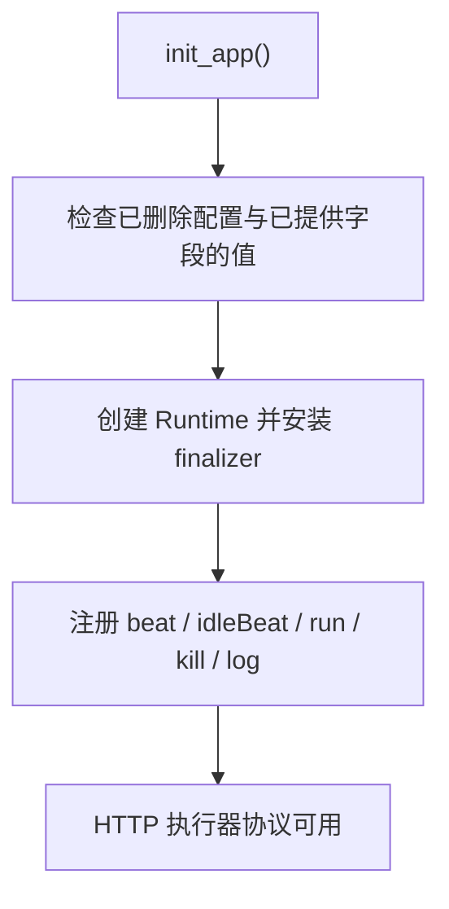
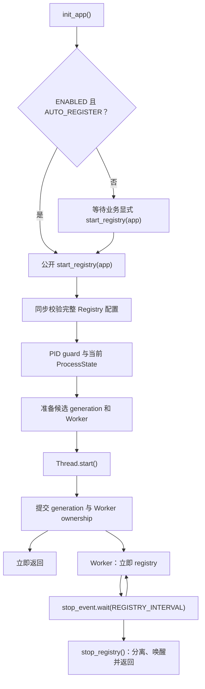

[English](deployment.md) | [简体中文](deployment.zh-CN.md)

# 部署

## 两条互不依赖的路径

初始化 HTTP 执行器协议并不要求 Registry lifecycle 正在运行。



Registry 是另一条独立的进程级路径：



五个执行器端点、Handler 分发、任务执行与 Callback API 都没有变化。Registry 仍然
在 Worker 启动后立即注册，随后每隔 `REGISTRY_INTERVAL` 续约。

## 生命周期停止

`stop_registry()` 是本地非阻塞停止：不 join、不访问 Admin，也不修改最近的
`registered` 快照。即使 Worker 已经退出，稍后调用 `stop_registry(remove=True)`
仍可消耗同一 lifecycle generation 尚未使用的一次自动 Remove 资格。

`stop_registry(remove=True)` 在后台执行注销。Pending Remove 可以被更新的成功 start
取消；Active Remove 不强制取消，新 Worker 会在后台等待它结束。当前进程中的续约、
后台注销、`register_executor()` 与 `remove_executor()` 共用一个网络锁，绝不并发。

需要确定性注销及其 `CallResult` 时使用：

```python
xxl_job.stop_registry(app)
result = xxl_job.remove_executor(app)
```

不要针对同一次意图再同时使用 `stop_registry(remove=True)`。

## 执行器地址

`XXL_JOB_EXECUTOR_ADDRESS` 必须是 Admin 能访问的 URL。容器或多主机部署通常应填
服务地址而不是 `127.0.0.1`。只填写基础 URL；加载配置时会自动附加
`XXL_JOB_ROUTE_PREFIX`。

## Gunicorn preload 与 fork 安全

应用可能在 fork 前导入时，使用显式 Registry 启动：

```python
app.config["XXL_JOB_AUTO_REGISTER"] = False
xxl_job.init_app(app)

# 只在确实负责 Registry 续约的 Worker/进程中调用。
xxl_job.start_registry(app)
```

所有本地状态访问都会先执行 PID guard。子进程不会获取父进程 Lock、读取父 Worker、
join 父 Thread 或设置父 Event，而是直接替换整个 Registry ProcessState。Runtime、
Handler、Callback、路由、纯配置与无进程资源的 AdminClient 继续保留。

这只是进程安全，不是 Leader 选举。每个调用 `start_registry()` 的 Gunicorn Worker
仍拥有自己的进程级 Registry Worker；Flask-XXLJob 不增加跨进程锁，也不会自动挑选
唯一 Worker。

## Flask 与 Celery 共用工厂

两类进程都初始化协议能力，但只在真正负责续约的进程启动 Registry：

```python
def create_app(start_executor_registry=False):
    app = Flask(__name__)
    app.config["XXL_JOB_AUTO_REGISTER"] = False
    xxl_job.init_app(app)
    if start_executor_registry:
        xxl_job.start_registry(app)
    return app
```

Flask-XXLJob 不检测 Celery，也不创建 Celery 任务。

## 退出注销与共享地址

`XXL_JOB_DEREGISTER_ON_EXIT=False` 是默认值。finalizer 会停止各进程的本地续约，
但不会删除共享的 Admin 身份。只有明确满足“一个 Python 进程独占一个执行器地址”
时才应开启。退出注销是 best-effort，finalizer 永不等待 Worker、Event、cleanup actor
或 Admin RPC；解释器立即退出、`SIGKILL` 与容器强制终止都可能导致注销未完成。

退出路径遵守同一套 lifecycle Remove 资格：generation 为零时不注销，同一代最多自动
尝试一次。同步 `register_executor()` 不创建 lifecycle，因此退出时不会自动配对；
需要时请显式调用 `remove_executor()`。

## 任务超时与日志

任务超时仍由 XXL-JOB Admin 的任务配置决定，不属于 Registry 设置。Celery 等异步
任务结束时，业务应调用 `callback_success()` 或 `callback_failure()`。

容器环境建议只使用控制台托管日志。日志 Handler 会等待 Registry 后台收尾完成，并
且最多关闭一次。标准轮转文件 Handler 只保证进程内管理，不能使多个 Worker 共享同一
日志文件变得安全。
