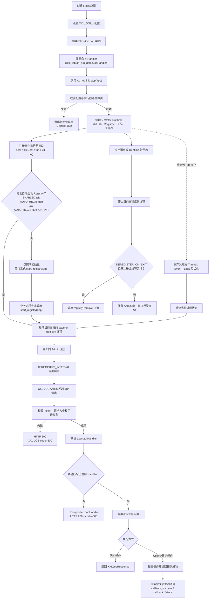

[English](deployment.md) | [简体中文](deployment.zh-CN.md)

# 部署

## 完整使用流程



## 执行器地址

将 `XXL_JOB_EXECUTOR_ADDRESS` 设置为 XXL-JOB Admin 能够访问的 URL。在容器化或多主机部署中，这通常是服务地址，而不是 `127.0.0.1`。地址只需填写服务基础 URL；加载配置时会自动附加 `XXL_JOB_ROUTE_PREFIX`。

## 长任务的超时

任务超时在 XXL-JOB Admin 按任务配置（单位：秒），不属于 Flask-XXLJob。对接
Celery 等异步 worker 时，请将该超时调到大于最长执行时间，并在 worker 结束后调用
`callback_success` / `callback_failure`。详见[任务结果回调](callback.zh-CN.md)。

## 自动 Registry 生命周期

当 `XXL_JOB_ENABLED`、`XXL_JOB_AUTO_REGISTER` 与
`XXL_JOB_AUTO_REGISTER_ON_INIT` 均为 `True` 时，`init_app()` 会启动守护注册线程。
后台线程会立即注册，之后按配置间隔续约；注册失败只记录日志，不会导致应用崩溃。
`start_registry(app)` 非阻塞且幂等。

应用构造与 Registry 生命周期属于不同进程阶段时，设置
`XXL_JOB_AUTO_REGISTER_ON_INIT=False`：

```python
app.config.update(
    XXL_JOB_AUTO_REGISTER=True,
    XXL_JOB_AUTO_REGISTER_ON_INIT=False,
)
xxl_job.init_app(app)

# 仅在当前进程应拥有续约线程后调用。
xxl_job.start_registry(app)
```

扩展不会检查 `app.debug`、`WERKZEUG_RUN_MAIN`、Gunicorn 或 Celery；由宿主决定
哪个进程调用 `start_registry()`。

## Gunicorn preload 与 fork 安全

使用 Gunicorn `--preload` 时应延迟启动，并在 fork 后的 Worker 初始化阶段调用
`start_registry(app)`，不要在 preload master 中启动。Flask 应用对象跨 fork 继承时，
扩展会在接触继承锁之前识别 PID 变化，并重建本进程的线程、Event、锁、关闭标记与
Registry 状态，不会 join 父进程线程。

这只保证每个 Worker 的进程内状态正确，不会选举唯一 Registry Leader。每个调用
`start_registry()` 的 Worker 都会拥有一个续约线程。

## 共享地址与多 Worker

使用不同执行器地址的 Worker 表示不同执行器实例，可保持
`XXL_JOB_DEREGISTER_ON_EXIT=True`。使用相同应用名和地址的 Worker 共享一个
Admin 侧身份，此时建议：

```python
app.config.update(
    XXL_JOB_DEREGISTER_ON_EXIT=False,
)
```

Runtime 清理仍会停止各 Worker 的本地线程，但任一 Worker 退出不会删除共享身份。
该配置只控制自动清理：显式 `stop_registry()` 默认仍会注销，
`stop_registry(remove=False)` 则只停止续约。

## Flask 与 Celery 共用 Application Factory

两类进程都初始化扩展，但只在对外提供执行器接口的 Web 进程中启动 Registry：

```python
def create_app(start_executor_registry=False):
    app = Flask(__name__)
    app.config["XXL_JOB_AUTO_REGISTER_ON_INIT"] = False
    xxl_job.init_app(app)
    if start_executor_registry:
        xxl_job.start_registry(app)
    return app


web_app = create_app(start_executor_registry=True)
# Celery、CLI 与测试直接调用 create_app()，不启动 Registry。
```

Flask-XXLJob 不检测 Celery，也不创建 Celery 任务；生命周期归属由宿主明确决定。

容器中的插件诊断日志建议仅输出到控制台，由平台统一采集、保留与轮转：

```python
app.config.update(
    XXL_JOB_LOG_ENABLED=True,
    XXL_JOB_LOG_FILE_ENABLED=False,
    XXL_JOB_LOG_CONSOLE_ENABLED=True,
)
```

标准 `RotatingFileHandler` 只管理当前进程，不能保证 Gunicorn 等多个工作进程共享
同一文件时安全。请改用独立文件、宿主 Logging 或控制台聚合。详见[日志](logging.zh-CN.md)。

## 单次注册

你可以关闭自动续约，改为通过 CLI 单次注册：

```bash
flask --app "project:create_app" xxljob register
```
